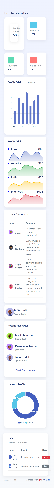
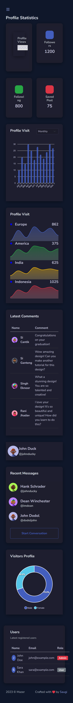

# 🚀 Task 3 – Front-End Skill Assessment

## 📌 Project Overview
This project is a customized version of the **Mazer Admin Dashboard**.  
The objective was to modify an existing Bootstrap 5 template and integrate dynamic data using JSON.

---

## 🎯 Features Implemented

### ✅ UI/UX Customization
- Redesigned dashboard cards (uniform layout)
- Modern dark/light theme toggle
- Sidebar gradient + glow effect
- Smooth hover animations on cards
- Responsive layout (mobile + desktop)

---

### 📊 Data Integration (JSON Based)
- Data loaded from `data/data.json`
- Dynamic update of:
  - Profile Views
  - Followers
  - Following
  - Saved Posts

---

### 📈 Interactive Charts (ApexCharts)
- Bar chart (Profile Visits)
- Mini area charts (Region-wise)
- Donut chart (Visitors Profile)
- Dropdown filter (Weekly / Monthly)

---
## 📸 Screenshots

### 🌙 Dark Mode


### ☀️ Light Mode

### ⚡ Enhancements
- Animated numbers (count-up effect)
- Loading shimmer effect


---

## 📂 Project Structure
mazer/
│
├── src/
│ ├── assets/
│ │ ├── js/
│ │ ├── scss/
│ │
│ ├── layouts/
│ ├── index.html
│
├── data/
│ └── data.json
│
├── README.md


## ⚙️ Setup Instructions

1. Clone the repository:
```bash
git clone <your-repo-link>
Navigate to project:
cd mazer
Install dependencies:
npm install
Run the project:
npm run dev
